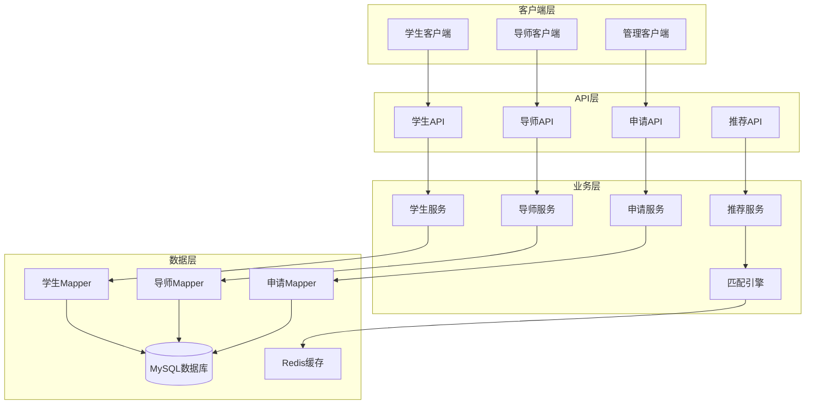

# 🎓 JOSP-ChoosePhd - 博士选择系统后端


## 📖 项目简介

JOSP-ChoosePhd是一个博士导师选择系统的后端服务,帮助学生找到合适的博士导师,提供导师信息管理、学生申请、匹配推荐等功能。

## 🏗️ 系统架构



## 🚀 快速开始

### 环境要求

- JDK 17+
- Maven 3.6+
- MySQL 8.0+
- Redis 6.0+

### 安装步骤

```bash
# 1. 克隆项目
git clone https://github.com/yourusername/JOSP-choosePhdJava.git

# 2. 进入项目目录
cd JOSP-choosePhdJava

# 3. 配置数据库
# 修改 src/main/resources/application.yml
spring:
  datasource:
    url: jdbc:mysql://localhost:3306/choose_phd?useUnicode=true&characterEncoding=utf-8
    username: root
    password: your_password

# 4. 初始化数据库
mysql -u root -p < db/schema.sql

# 5. 编译项目
mvn clean install

# 6. 运行项目
mvn spring-boot:run
```

## 🛠️ 技术栈

| 技术 | 版本 | 说明 |
|------|------|------|
| Spring Boot | 3.x | 应用框架 |
| MyBatis | 3.5+ | ORM框架 |
| MySQL | 8.0+ | 关系数据库 |
| Redis | 6.0+ | 缓存数据库 |
| Spring Security | 3.x | 安全框架 |
| JWT | - | 令牌认证 |
| Maven | 3.6+ | 项目管理工具 |

## 📁 项目结构

```
JOSP-choosePhdJava/
├── src/
│   ├── main/
│   │   ├── java/
│   │   │   └── com/josp/choosephd/
│   │   │       ├── controller/      # 控制器层
│   │   │       ├── service/         # 业务逻辑层
│   │   │       ├── mapper/          # 数据访问层
│   │   │       ├── entity/          # 实体类
│   │   │       ├── dto/             # 数据传输对象
│   │   │       ├── vo/              # 视图对象
│   │   │       ├── config/          # 配置类
│   │   │       ├── recommend/       # 推荐引擎
│   │   │       └── utils/           # 工具类
│   │   └── resources/
│   │       ├── mapper/              # MyBatis映射文件
│   │       ├── application.yml      # 配置文件
│   │       └── db/                  # 数据库脚本
│   └── test/                        # 测试代码
├── pom.xml                          # Maven配置
└── README.md                        # 项目说明
```

## 🔑 核心功能

### 导师管理

```java
@RestController
@RequestMapping("/api/teachers")
public class TeacherController {
    
    @Autowired
    private TeacherService teacherService;
    
    @PostMapping
    public Result<Teacher> createTeacher(@RequestBody TeacherDTO teacherDTO) {
        return Result.success(teacherService.createTeacher(teacherDTO));
    }
    
    @GetMapping("/{id}")
    public Result<TeacherVO> getTeacherDetail(@PathVariable Long id) {
        return Result.success(teacherService.getTeacherDetail(id));
    }
    
    @GetMapping("/search")
    public Result<Page<TeacherVO>> searchTeachers(
        @RequestParam String keyword,
        @RequestParam(required = false) String researchField,
        @RequestParam(defaultValue = "1") Integer page,
        @RequestParam(defaultValue = "10") Integer size
    ) {
        return Result.success(teacherService.searchTeachers(keyword, researchField, page, size));
    }
}
```

### 学生申请

```java
@Service
public class ApplicationService {
    
    @Autowired
    private ApplicationMapper applicationMapper;
    
    @Autowired
    private NotificationService notificationService;
    
    @Transactional
    public Application submitApplication(ApplicationDTO dto) {
        // 创建申请
        Application application = new Application();
        BeanUtils.copyProperties(dto, application);
        application.setStatus(ApplicationStatus.PENDING);
        applicationMapper.insert(application);
        
        // 通知导师
        notificationService.notifyTeacher(application.getTeacherId(), 
            "收到新的学生申请");
        
        return application;
    }
    
    public void updateApplicationStatus(Long id, ApplicationStatus status) {
        Application application = applicationMapper.selectById(id);
        application.setStatus(status);
        applicationMapper.updateById(application);
        
        // 通知学生
        notificationService.notifyStudent(application.getStudentId(),
            "您的申请状态已更新为: " + status.getDesc());
    }
}
```

### 智能推荐

```java
@Service
public class RecommendService {
    
    @Autowired
    private MatchEngine matchEngine;
    
    public List<TeacherRecommendVO> recommendTeachers(Long studentId) {
        // 获取学生信息
        Student student = studentService.getById(studentId);
        
        // 计算匹配度
        List<Teacher> teachers = teacherService.getAll();
        List<TeacherRecommendVO> recommendations = new ArrayList<>();
        
        for (Teacher teacher : teachers) {
            double score = matchEngine.calculateMatchScore(student, teacher);
            if (score > 0.6) { // 匹配度阈值
                TeacherRecommendVO vo = new TeacherRecommendVO();
                BeanUtils.copyProperties(teacher, vo);
                vo.setMatchScore(score);
                recommendations.add(vo);
            }
        }
        
        // 按匹配度排序
        recommendations.sort((a, b) -> Double.compare(b.getMatchScore(), a.getMatchScore()));
        
        return recommendations;
    }
}
```

### 匹配引擎

```java
@Component
public class MatchEngine {
    
    public double calculateMatchScore(Student student, Teacher teacher) {
        double score = 0.0;
        
        // 研究方向匹配度 (40%)
        score += calculateFieldMatch(student.getResearchField(), 
                                     teacher.getResearchField()) * 0.4;
        
        // 学术背景匹配度 (30%)
        score += calculateBackgroundMatch(student, teacher) * 0.3;
        
        // 地理位置 (20%)
        score += calculateLocationMatch(student.getLocation(), 
                                       teacher.getLocation()) * 0.2;
        
        // 其他因素 (10%)
        score += calculateOtherFactors(student, teacher) * 0.1;
        
        return score;
    }
    
    private double calculateFieldMatch(String studentField, String teacherField) {
        // 使用文本相似度算法计算研究方向匹配度
        return SimilarityUtils.cosineSimilarity(studentField, teacherField);
    }
}
```

## 📊 API文档

### 导师管理API

| 接口 | 方法 | 路径 | 说明 |
|------|------|------|------|
| 创建导师 | POST | /api/teachers | 创建导师信息 |
| 获取导师 | GET | /api/teachers/{id} | 获取导师详情 |
| 更新导师 | PUT | /api/teachers/{id} | 更新导师信息 |
| 删除导师 | DELETE | /api/teachers/{id} | 删除导师 |
| 搜索导师 | GET | /api/teachers/search | 搜索导师列表 |

### 申请管理API

| 接口 | 方法 | 路径 | 说明 |
|------|------|------|------|
| 提交申请 | POST | /api/applications | 提交申请 |
| 查看申请 | GET | /api/applications/{id} | 查看申请详情 |
| 更新状态 | PUT | /api/applications/{id}/status | 更新申请状态 |
| 我的申请 | GET | /api/applications/my | 查看我的申请 |

### 推荐系统API

| 接口 | 方法 | 路径 | 说明 |
|------|------|------|------|
| 推荐导师 | GET | /api/recommend/teachers | 获取推荐导师列表 |
| 计算匹配度 | POST | /api/recommend/match | 计算师生匹配度 |

## 🎯 核心特性

- **智能匹配**: 基于多维度因素的导师推荐算法
- **实时通知**: 申请状态变更实时推送
- **数据可视化**: 导师信息和学生申请数据可视化展示
- **权限控制**: 学生、导师、管理员多角色权限管理
- **全文搜索**: 支持导师信息的全文检索

## 📝 更新日志

### v1.0.0 (2024-01-01)
- ✨ 初始版本发布
- ✨ 实现导师信息管理
- ✨ 实现学生申请流程
- ✨ 实现智能推荐算法
- ✨ 实现实时通知功能

## 👥 贡献指南

欢迎贡献代码!请遵循以下步骤:

1. Fork本仓库
2. 创建特性分支 (`git checkout -b feature/AmazingFeature`)
3. 提交更改 (`git commit -m 'Add some AmazingFeature'`)
4. 推送到分支 (`git push origin feature/AmazingFeature`)
5. 提交Pull Request

## 📄 许可证

本项目采用 MIT 许可证 - 查看 [LICENSE](LICENSE) 文件了解详情

## 📮 联系方式

项目维护者: JOSP Team

---

⭐ 如果这个项目对你有帮助,欢迎Star支持!
