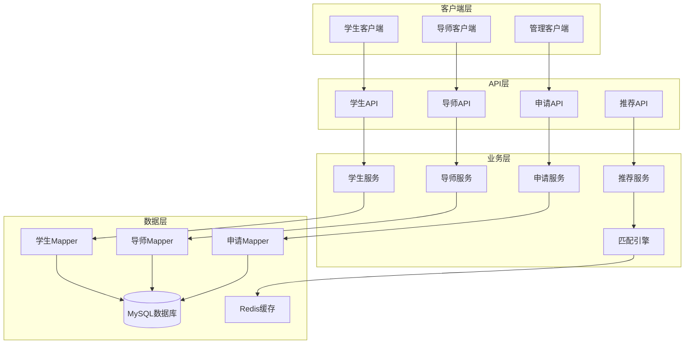

# 🎓 JOSP-ChoosePhdJava - 大学排名查询系统后端


## 📖 项目简介

JOSP-ChoosePhdJava是一个大学排名查询系统的后端服务,提供QS、US News等世界大学排名数据的查询、筛选和可视化功能。支持按国家、大洲、排名等条件查询大学信息,为考研/留学择校提供数据支持。

**关联前端项目**: [JOSP-choosePhdVue3](../JOSP-choosePhdVue3)

## 🏗️ 系统架构



## 🚀 快速开始

### 环境要求

- JDK 17+
- Maven 3.6+
- MySQL 8.0+
- Redis 6.0+

### 安装步骤

```bash
# 1. 克隆项目
git clone https://github.com/yourusername/JOSP-choosePhdJava.git

# 2. 进入项目目录
cd JOSP-choosePhdJava

# 3. 配置数据库
# 修改 src/main/resources/application.yml
spring:
  datasource:
    url: jdbc:mysql://localhost:3306/choose_phd?useUnicode=true&characterEncoding=utf-8
    username: root
    password: your_password

# 4. 初始化数据库
mysql -u root -p < db/schema.sql

# 5. 编译项目
mvn clean install

# 6. 运行项目
mvn spring-boot:run
```

## 🛠️ 技术栈

| 技术 | 版本 | 说明 |
|------|------|------|
| Spring Boot | 3.x | 应用框架 |
| MyBatis | 3.5+ | ORM框架 |
| MySQL | 8.0+ | 关系数据库 |
| Redis | 6.0+ | 缓存数据库 |
| Spring Security | 3.x | 安全框架 |
| JWT | - | 令牌认证 |
| Maven | 3.6+ | 项目管理工具 |

## 📁 项目结构

```
JOSP-choosePhdJava/
├── src/
│   ├── main/
│   │   ├── java/
│   │   │   └── com/josp/choosephd/
│   │   │       ├── controller/      # 控制器层
│   │   │       ├── service/         # 业务逻辑层
│   │   │       ├── mapper/          # 数据访问层
│   │   │       ├── entity/          # 实体类
│   │   │       ├── dto/             # 数据传输对象
│   │   │       ├── vo/              # 视图对象
│   │   │       ├── config/          # 配置类
│   │   │       ├── recommend/       # 推荐引擎
│   │   │       └── utils/           # 工具类
│   │   └── resources/
│   │       ├── mapper/              # MyBatis映射文件
│   │       ├── application.yml      # 配置文件
│   │       └── db/                  # 数据库脚本
│   └── test/                        # 测试代码
├── pom.xml                          # Maven配置
└── README.md                        # 项目说明
```

## 🔑 核心功能

### 大学排名查询

- **QS排名查询**: 支持QS世界大学排名查询和筛选
- **US News排名查询**: 支持US News世界大学排名查询
- **CS专业排名**: 支持计算机科学专业单独排名查询
- **多条件筛选**: 按国家、大洲、排名范围等条件筛选
- **ECharts可视化**: 提供排名数据可视化接口

```java
@RestController
@RequestMapping("/query")
public class QueryAllUniversityController {
    
    @GetMapping("/queryAll")
    @ApiOperation("查询大学汇总排名")
    public Page<UniversityRankingsAll> queryAllUniversityRank(
            @RequestParam Integer page,
            @RequestParam Integer limit,
            @RequestParam(required = false) String universityNameChinese,
            @RequestParam(required = false) String universityTagsState,
            @RequestParam(required = false) String universityTags,
            @RequestParam(required = false, defaultValue = "100") Integer currentRank
    ) {
        return allQueryServiceImpl.queryAllData(page, limit,
                universityNameChinese, universityTagsState, universityTags, currentRank);
    }
    
    @GetMapping("/queryAllEcharts")
    @ApiOperation("查询echarts大学汇总排名")
    public ChartData queryAllUniversityRank(
            @RequestParam(required = false) String universityNameChinese,
            @RequestParam(required = false) String universityTagsState,
            @RequestParam(required = false) String universityTags,
            @RequestParam(required = false, defaultValue = "10") Integer currentRank,
            @RequestParam(required = false) String rankVariant
    ) {
        return allQueryServiceImpl.queryAllEchartsData(
                universityNameChinese, universityTagsState, universityTags, currentRank, rankVariant);
    }
}
```

### 用户登录认证

```java
@RestController
@RequestMapping("/vue-element-admin/user")
public class LoginController {
    
    @PostMapping("/login")
    public ShowResult<LoginUser> userLogin(@RequestBody LoginUser loginUser) {
        // MD5密码加密验证
        String passwordMd5DigestAsHex = DigestUtils.md5DigestAsHex(loginUser.getPassword().getBytes());
        LambdaQueryWrapper<LoginUser> lambdaQueryWrapper = new LambdaQueryWrapper<>();
        lambdaQueryWrapper.eq(LoginUser::getUsername, loginUser.getUsername())
                         .eq(LoginUser::getPassword, passwordMd5DigestAsHex);
        LoginUser userServiceOne = loginUserService.getOne(lambdaQueryWrapper);
        if (StrUtil.isEmptyIfStr(userServiceOne)) {
            return ShowResult.sendError("账号或密码错误");
        }
        return ShowResult.sendSuccess(userServiceOne);
    }
    
    @GetMapping("/info")
    public ShowResult<AccountRole> userInfo() {
        // 返回用户角色信息
        AccountRole accountRole = new AccountRole();
        accountRole.setRoles(Arrays.asList("admin"));
        return ShowResult.sendSuccess(accountRole);
    }
}
```

## 📊 数据库表结构

### 1. login_user - 用户登录表
```sql
CREATE TABLE login_user (
    id BIGINT PRIMARY KEY AUTO_INCREMENT COMMENT '主键',
    username VARCHAR(50) COMMENT '用户名',
    password VARCHAR(100) COMMENT '密码(MD5加密)',
    create_time DATETIME COMMENT '创建时间'
) COMMENT='用户登录表';
```

### 2. university_rankings_all - 大学排名汇总表
```sql
CREATE TABLE university_rankings_all (
    id INT PRIMARY KEY AUTO_INCREMENT COMMENT '主键',
    university_name_chinese VARCHAR(200) COMMENT '大学名称(中文)',
    university_name_english VARCHAR(200) COMMENT '大学名称(英文)',
    university_tags VARCHAR(100) COMMENT '大学标签(国家)',
    university_tags_state VARCHAR(100) COMMENT '大学标签(大洲)',
    ranking_year INT COMMENT '排名年份',
    current_rank_integer_qs INT COMMENT 'QS当前排名',
    current_rank_integer_qs_cs INT COMMENT 'QS计算机排名',
    current_rank_integer_usnews INT COMMENT 'US News当前排名',
    current_rank_integer_usnews_cs INT COMMENT 'US News计算机排名'
) COMMENT='大学排名数据汇总表';
```

### 3. choose_phd - 院校信息表
```sql
CREATE TABLE choose_phd (
    id BIGINT PRIMARY KEY AUTO_INCREMENT COMMENT '主键',
    university_name VARCHAR(200) COMMENT '大学名称',
    ranking_data TEXT COMMENT '大学排名相关数据',
    official_website VARCHAR(500) COMMENT '院校官网链接',
    recruitment_website VARCHAR(500) COMMENT '社招网站链接',
    priority INT COMMENT '优先级',
    country_region VARCHAR(100) COMMENT '国家/地区',
    scholarship TEXT COMMENT '奖学金信息',
    salary_amount DECIMAL(10,2) COMMENT '薪资金额',
    salary_currency VARCHAR(20) COMMENT '薪资货币类型',
    living_expenses_amount DECIMAL(10,2) COMMENT '生活费用',
    living_expenses_currency VARCHAR(20) COMMENT '生活费用货币类型',
    research_field TEXT COMMENT '研究方向',
    application_requirements TEXT COMMENT '申请要求',
    application_deadline DATE COMMENT '招生截止时间',
    drug_prohibition BOOLEAN COMMENT '是否禁毒',
    gun_control BOOLEAN COMMENT '是否控枪',
    qs_rank INT COMMENT 'QS排名',
    usnews_rank INT COMMENT 'US News排名',
    education_duration VARCHAR(50) COMMENT '学制',
    application_difficulty VARCHAR(50) COMMENT '申请难度',
    reference_material TEXT COMMENT '参考资料'
) COMMENT='院校详细信息表';
```

### 4. university_rankings_qs - QS排名表
```sql
CREATE TABLE university_rankings_qs (
    id INT PRIMARY KEY AUTO_INCREMENT COMMENT '主键',
    university_name_chinese VARCHAR(200) COMMENT '大学名称(中文)',
    university_name_english VARCHAR(200) COMMENT '大学名称(英文)',
    university_tags VARCHAR(100) COMMENT '国家',
    university_tags_state VARCHAR(100) COMMENT '大洲',
    ranking_year INT COMMENT '排名年份',
    current_rank_integer INT COMMENT '当前排名'
) COMMENT='QS世界大学排名表';
```

### 5. university_rankings_usnews - US News排名表
```sql
CREATE TABLE university_rankings_usnews (
    id INT PRIMARY KEY AUTO_INCREMENT COMMENT '主键',
    university_name_chinese VARCHAR(200) COMMENT '大学名称(中文)',
    university_name_english VARCHAR(200) COMMENT '大学名称(英文)',
    university_tags VARCHAR(100) COMMENT '国家',
    university_tags_state VARCHAR(100) COMMENT '大洲',
    ranking_year INT COMMENT '排名年份',
    current_rank_integer INT COMMENT '当前排名'
) COMMENT='US News世界大学排名表';
```

## 🎯 核心特性

- **多源排名数据**: 整合QS、US News等多个权威排名数据源
- **专业排名**: 支持计算机科学等专业单独排名查询
- **多维筛选**: 按国家、大洲、排名范围等条件灵活筛选
- **可视化接口**: 提供ECharts图表数据接口,支持数据可视化展示
- **分页查询**: 支持大数据量分页查询,性能优秀
- **Knife4j文档**: 集成Knife4j接口文档,方便API测试

## 📝 更新日志

### v1.0.0 (2024-01-01)
- ✨ 初始版本发布
- ✨ 实现导师信息管理
- ✨ 实现学生申请流程
- ✨ 实现智能推荐算法
- ✨ 实现实时通知功能

## 👥 贡献指南

欢迎贡献代码!请遵循以下步骤:

1. Fork本仓库
2. 创建特性分支 (`git checkout -b feature/AmazingFeature`)
3. 提交更改 (`git commit -m 'Add some AmazingFeature'`)
4. 推送到分支 (`git push origin feature/AmazingFeature`)
5. 提交Pull Request

## 📄 许可证

本项目采用 AGPL-3.0 许可证 - 查看 [LICENSE](LICENSE) 文件了解详情

## 📮 联系方式

项目维护者: JOSP Team

---

⭐ 如果这个项目对你有帮助,欢迎Star支持!
