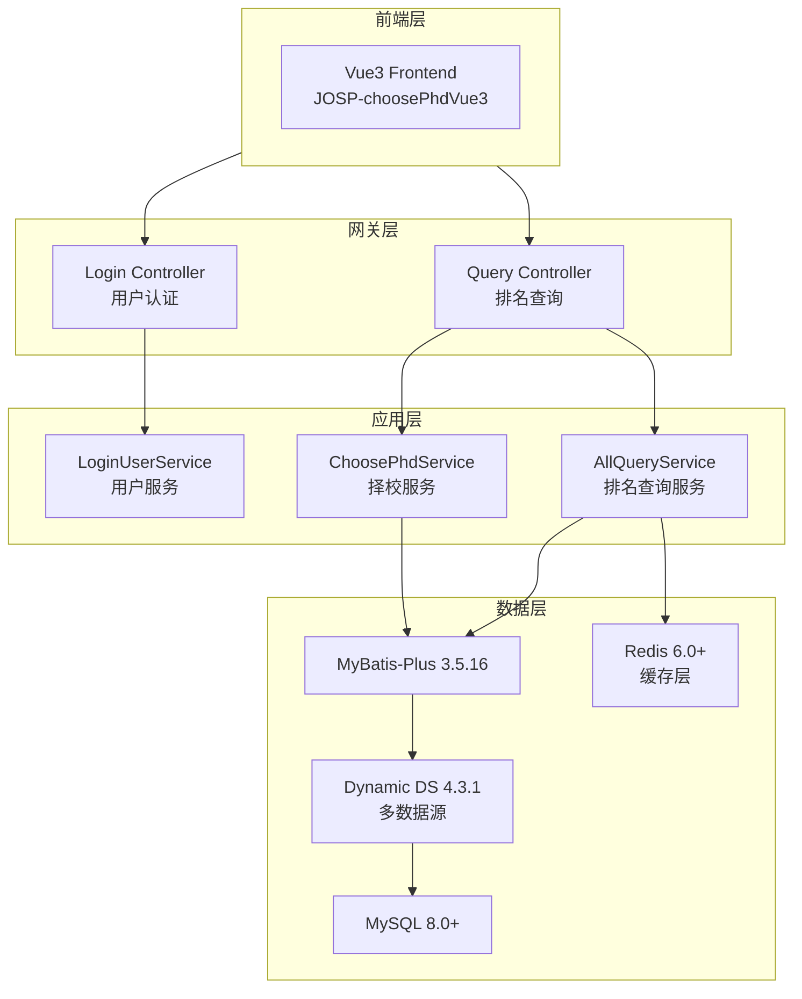
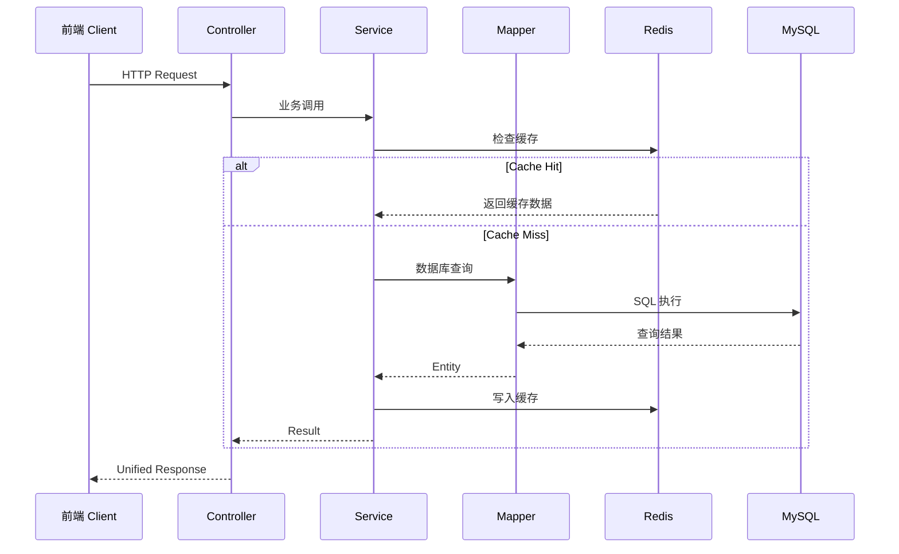
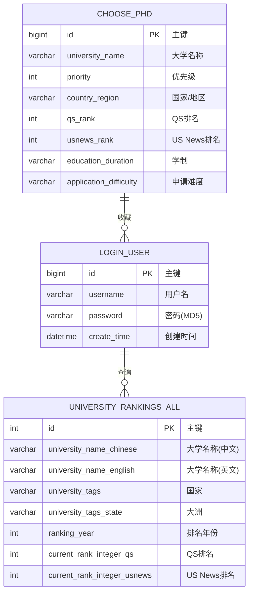

# JOSP-ChoosePhdJava 项目规格说明书

## 1. 项目概述

- **项目名称**: JOSP-ChoosePhdJava
- **项目类型**: Spring Boot REST API 后端服务
- **核心功能**: 大学排名查询系统的后端服务，提供QS、US News等世界大学排名数据的查询、筛选和可视化功能
- **目标用户**: 考研/留学择校的学生和教育研究者

## 2. 技术栈

| 类别 | 技术 | 版本 |
|------|------|------|
| 语言 | Java | 25 |
| 框架 | Spring Boot | 3.4.4 |
| ORM | MyBatis-Plus | 3.5.16 |
| 数据库 | MySQL | 8.0+ |
| 缓存 | Redis | 6.0+ |
| API文档 | Knife4j | 3.0.3 |
| JSON处理 | fastjson2 | 2.0.61 |
| 工具库 | Hutool | 5.8.44 |
| 分页插件 | PageHelper | 6.1.0 |
| 多数据源 | dynamic-datasource | 4.3.1 |

## 3. 项目结构

```
JOSP-choosePhdJava/
├── src/main/java/wo1261931780/choosecollegejava/
│   ├── controller/          # 控制器层
│   │   ├── LoginController.java
│   │   ├── QueryAllUniversityController.java
│   │   └── ...
│   ├── service/            # 服务层
│   │   ├── AllQueryService.java
│   │   ├── LoginUserService.java
│   │   └── ...
│   ├── mapper/             # 数据访问层
│   │   ├── UniversityRankingsAllMapper.java
│   │   ├── ChoosePhdMapper.java
│   │   └── ...
│   ├── entity/             # 实体类
│   │   ├── UniversityRankingsAll.java
│   │   ├── ChoosePhd.java
│   │   ├── LoginUser.java
│   │   └── ...
│   ├── common/            # 通用类
│   │   ├── ShowResult.java
│   │   └── ...
│   └── ChooseCollegeJavaApplication.java  # 启动类
├── src/main/resources/
│   ├── application.yml     # 应用配置
│   └── static/            # 静态资源
├── pom.xml
└── README.md
```

## 4. 架构设计

### 4.1 系统架构图



### 4.2 请求处理流程



### 4.3 数据库 ER 图（核心表）



## 5. 数据库表结构

### 4.1 login_user - 用户登录表
| 字段 | 类型 | 说明 |
|------|------|------|
| id | BIGINT | 主键 |
| username | VARCHAR(50) | 用户名 |
| password | VARCHAR(100) | 密码(MD5加密) |
| create_time | DATETIME | 创建时间 |

### 4.2 university_rankings_all - 大学排名汇总表
| 字段 | 类型 | 说明 |
|------|------|------|
| id | INT | 主键 |
| university_name_chinese | VARCHAR(200) | 大学名称(中文) |
| university_name_english | VARCHAR(200) | 大学名称(英文) |
| university_tags | VARCHAR(100) | 大学标签(国家) |
| university_tags_state | VARCHAR(100) | 大学标签(大洲) |
| ranking_year | INT | 排名年份 |
| current_rank_integer_qs | INT | QS当前排名 |
| current_rank_integer_qs_cs | INT | QS计算机排名 |
| current_rank_integer_usnews | INT | US News当前排名 |
| current_rank_integer_usnews_cs | INT | US News计算机排名 |

### 4.3 choose_phd - 院校信息表
| 字段 | 类型 | 说明 |
|------|------|------|
| id | BIGINT | 主键 |
| university_name | VARCHAR(200) | 大学名称 |
| ranking_data | TEXT | 大学排名相关数据 |
| official_website | VARCHAR(500) | 院校官网链接 |
| recruitment_website | VARCHAR(500) | 社招网站链接 |
| priority | INT | 优先级 |
| country_region | VARCHAR(100) | 国家/地区 |
| scholarship | TEXT | 奖学金信息 |
| salary_amount | DECIMAL(10,2) | 薪资金额 |
| salary_currency | VARCHAR(20) | 薪资货币类型 |
| living_expenses_amount | DECIMAL(10,2) | 生活费用 |
| living_expenses_currency | VARCHAR(20) | 生活费用货币类型 |
| research_field | TEXT | 研究方向 |
| application_requirements | TEXT | 申请要求 |
| application_deadline | DATE | 招生截止时间 |
| drug_prohibition | BOOLEAN | 是否禁毒 |
| gun_control | BOOLEAN | 是否控枪 |
| qs_rank | INT | QS排名 |
| usnews_rank | INT | US News排名 |
| education_duration | VARCHAR(50) | 学制 |
| application_difficulty | VARCHAR(50) | 申请难度 |
| reference_material | TEXT | 参考资料 |

### 4.4 university_rankings_qs - QS排名表
| 字段 | 类型 | 说明 |
|------|------|------|
| id | INT | 主键 |
| university_name_chinese | VARCHAR(200) | 大学名称(中文) |
| university_name_english | VARCHAR(200) | 大学名称(英文) |
| university_tags | VARCHAR(100) | 国家 |
| university_tags_state | VARCHAR(100) | 大洲 |
| ranking_year | INT | 排名年份 |
| current_rank_integer | INT | 当前排名 |

### 4.5 university_rankings_usnews - US News排名表
| 字段 | 类型 | 说明 |
|------|------|------|
| id | INT | 主键 |
| university_name_chinese | VARCHAR(200) | 大学名称(中文) |
| university_name_english | VARCHAR(200) | 大学名称(英文) |
| university_tags | VARCHAR(100) | 国家 |
| university_tags_state | VARCHAR(100) | 大洲 |
| ranking_year | INT | 排名年份 |
| current_rank_integer | INT | 当前排名 |

## 6. API 接口

### 6.1 用户认证
- `POST /vue-element-admin/user/login` - 用户登录（MD5密码验证）
- `GET /vue-element-admin/user/info` - 获取用户角色信息

### 6.2 大学排名查询
- `GET /query/queryAll` - 分页查询大学汇总排名
  - 参数: page, limit, universityNameChinese, universityTagsState, universityTags, currentRank
- `GET /query/queryAllEcharts` - 查询ECharts图表数据
  - 参数: universityNameChinese, universityTagsState, universityTags, currentRank, rankVariant

## 7. 核心特性

- **多源排名数据**: 整合QS、US News等多个权威排名数据源
- **专业排名**: 支持计算机科学等专业单独排名查询
- **多维筛选**: 按国家、大洲、排名范围等条件灵活筛选
- **可视化接口**: 提供ECharts图表数据接口,支持数据可视化展示
- **分页查询**: 支持大数据量分页查询,性能优秀
- **Knife4j文档**: 集成Knife4j接口文档,方便API测试
- **多数据源**: 支持动态多数据源配置

## 8. 配置说明

应用配置文件位于 `src/main/resources/application.yml`，主要配置项：

- 数据库连接配置 (MySQL)
- Redis缓存配置
- MyBatis-Plus配置
- 动态数据源配置
- Knife4j文档配置
- Actuator监控配置

## 9. 许可证

AGPL-3.0
